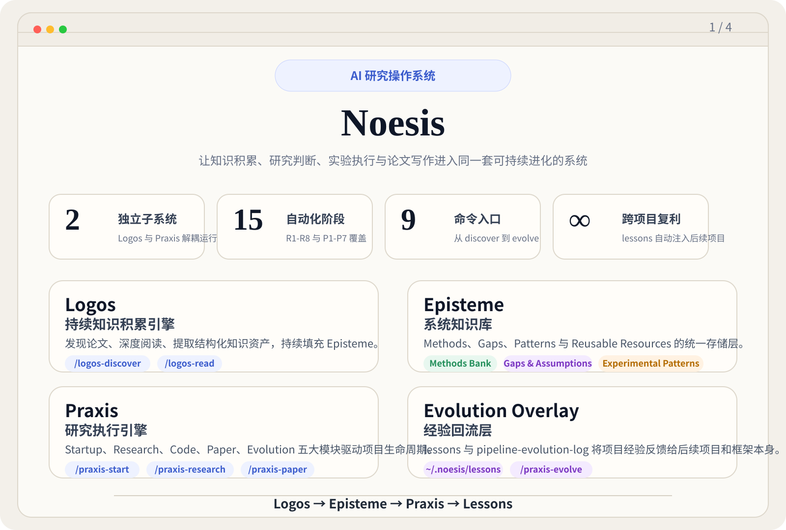
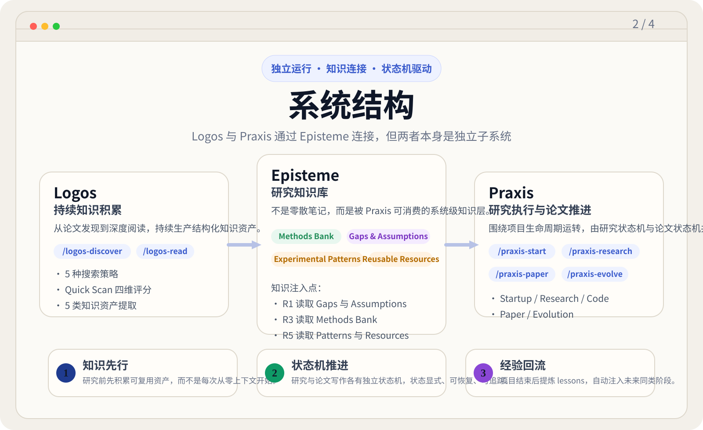
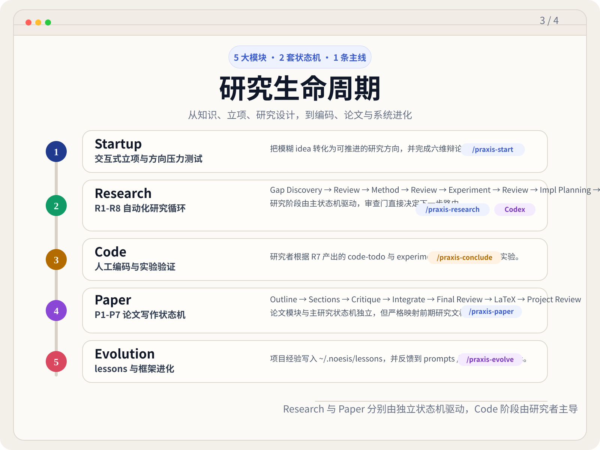
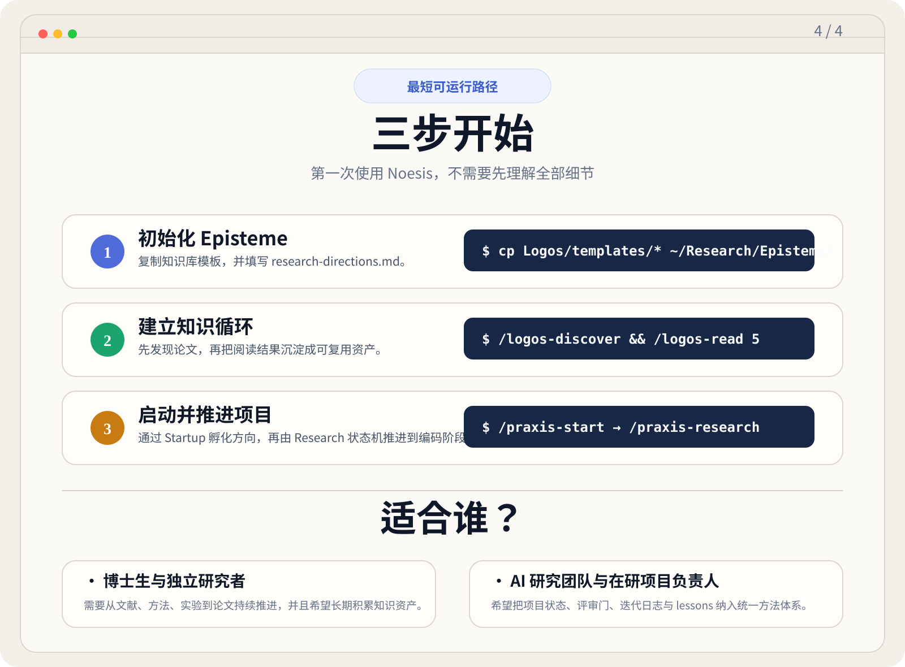

<div align="center">

# Noesis

### A Research Operating System for the Age of Agents

**让知识积累、研究判断、实验执行与论文写作，进入同一套可持续进化的系统。**

*νόησις · λόγος · πρᾶξις · ἐπιστήμη*

</div>

---

> 如果知识不能沉淀，灵感就只能反复从零开始。  
> 如果判断不能结构化，研究就会滑向随机游走。  
> 如果经验不能回流，项目完成之后，系统依然像第一次工作。

**Noesis** 试图解决的，正是这三件事。

它不是一个“帮你写点文档”的 AI 工具，也不是一套零散的 prompt 集合。  
它是一套运行在 **Claude Code** 上、面向 **AI/ML/DL 研究者与研究团队** 的 **科研操作系统**。

它也并不追求把研究者排除出系统。  
Noesis 的立场更明确：**把研究者从重复劳动中解放出来，但把方向判断、关键取舍与最终责任留给研究者本人。**

在这个前提下，它用一套可持续运转的架构来完成四件事：

- 用 **Logos** 持续发现、阅读、拆解论文，把知识沉淀为可复用的研究资产
- 用 **Episteme** 作为系统级知识库，让知识不再只服务于单个项目
- 用 **Praxis** 将项目从 idea、方法、实验、编码、论文推进到可交付成果
- 用 **lessons + framework evolution** 让每个项目都成为下一次研究的起点

如果把研究看成一项长期事业，而不是一串临时对话，那么 Noesis 的目标很明确：

**把一次性的 AI 协助，升级为可积累、可审查、可复盘、可进化的研究生产力。**

---

## Noesis 是什么

Noesis 由两个**彼此独立**、但通过知识库相连的子系统组成：

```text
Logos  ─────────────→  Episteme  ─────────────→  Praxis
知识积累                    知识库                    研究执行

/logos-discover           Methods Bank            /praxis-start
/logos-read               Gaps & Assumptions      /praxis-research
                          Experimental Patterns   /praxis-paper
                          Reusable Resources      /praxis-evolve
                                                   /praxis-present
```

| 系统 | 角色 | 核心任务 |
|------|------|----------|
| **Noesis** | 顶层方法论框架 | 统一研究流程、命令接口、状态管理与跨项目学习 |
| **Logos** | 知识积累引擎 | 发现论文、深度阅读、提取结构化知识资产 |
| **Episteme** | 外部知识库 | 存放阅读队列、论文笔记、领域地图与知识索引 |
| **Praxis** | 研究执行引擎 | 立项、方法设计、实验规划、论文写作、演化复盘 |

这意味着：**Noesis 不把科研理解成一条线性的流水线，而是一个“知识 → 判断 → 行动 → 经验回流”的闭环。**

---

## Noesis 选择的路线

同类系统正在朝两个方向快速演化：

- 一类把目标设为**尽可能自治的端到端科研 Agent**
- 一类把目标设为**覆盖尽可能多任务的通用研究工作台**

Noesis 选择的是第三条路线：**面向真实研究者的、监督优先的科研操作系统**。

| 路线 | 优先目标 | 常见特点 | Noesis 的选择 |
|------|----------|----------|---------------|
| **自治优先** | 让 AI 尽可能独立完成科研闭环 | 强调 autonomous、end-to-end、自主演化 | Noesis 不把研究者降为旁观者，而是保留关键判断权 |
| **广覆盖优先** | 让一套 CLI/skills 覆盖更多研究与开发任务 | 强调配置、插件、hooks、广义工作流 | Noesis 不追求无限扩展，而是聚焦 AI/ML 研究闭环本身 |
| **监督优先** | 让知识、判断、执行、复盘形成长期制度 | 强调知识库、审查门、状态机、热重启、经验回流 | **这正是 Noesis 的路线** |

因此，Noesis 最重要的卖点不是“更像一个超级 Agent”，而是：

- **更像一个长期可运营的研究系统**
- **更适合有明确研究责任的人来使用**
- **更适合需要跨项目积累能力的个人与团队**

<!-- ---

## 一图看懂 Noesis

<p align="center">
  
  
</p>
<p align="center">
  
  
</p> -->

---

## 设计哲学

Noesis 的设计建立在四个判断之上。

### 1. 研究不是从 idea 开始，而是从知识密度开始

很多研究项目之所以后劲不足，不是因为没有灵感，而是因为灵感没有足够深的知识背景。  
Noesis 先用 `Logos` 建立长期知识底座，再让 `Praxis` 消费这些资产推进项目。

### 2. AI 不是研究者的替身，而是被编排的研究劳动力

Noesis 不试图“替代研究判断”。  
它把研究者放在真正应该在的位置上：定义方向、做关键取舍、批准重要转折。  
把高耗时、高重复、需要大量上下文搬运的工作交给被良好约束的 Agents。

### 3. 研究质量来自审查，而不是来自第一次生成

Praxis 的关键阶段不是单次直出，而是通过独立评审、上下文隔离、外部视角和状态机路由来逼近更稳健的结论。  
在 Noesis 里，**批判机制本身就是生产力的一部分**。

### 4. 一个好系统，应该随着项目结束而变强

大多数 AI 工作流的最大浪费，在于项目结束之后经验被留在聊天记录里。  
Noesis 用 `lessons`、`pipeline-evolution-log` 和 `/praxis-evolve` 把经验重新注入系统，让未来项目直接受益。

---

## 为什么它不一样

| 指标 | 含义 | 对研究者的价值 |
|------|------|----------------|
| **2** | 独立子系统 | 知识积累与研究执行解耦，不把“读论文”和“做项目”混成一个大 prompt |
| **15** | 自动化阶段 | `R1-R8` 研究阶段 + `P1-P7` 论文阶段，覆盖从问题定义到论文定稿 |
| **9** | Slash Commands | 从论文发现、项目孵化到汇报展示，都有稳定入口 |
| **6** | Startup 辩论角色 | 在正式投入前先做方向压力测试，减少无效迭代 |
| **3** | Agent Tier | `standard`、`heavy`、`codex` 各司其职，不让所有任务共享同一种智能角色 |
| **∞** | 跨项目复利 | 每个项目的经验会回流到后续项目，而不是停留在单次产出里 |

Noesis 最核心的差异，不在于“能不能自动写点东西”，而在于它把科研的几个关键稀缺品重新组织起来了：

- **长期知识记忆**
- **结构化审查**
- **状态机式推进**
- **失败后的热重启**
- **对既有项目的接管能力**
- **跨项目能力复利**

---

## 系统能力总览

### Logos: 把论文变成知识资本

`Logos` 不是简单的“论文搜索 + 摘要生成”，而是一台持续运转的知识积累引擎。

#### 它能做什么

- 通过 **5 种搜索策略** 发现论文：关键词、引用链、作者、Venue、争议/负面结果
- 对候选论文做 **Quick Scan 四维评分**：相关性、可复用性、知识互补性、隐式假设潜力
- 按优先级维护 `reading-queue.md`
- 深度阅读论文，并抽取 **5 类结构化知识资产**
- 当某方向累计已读论文达到阈值后，自动生成 `domain-landscape.md`

#### 抽取的知识资产

| 资产类型 | 内容 |
|----------|------|
| **Methods Bank** | 核心机制、公式、适用条件、组件可解耦性 |
| **Gaps & Assumptions** | 显式 limitation 与隐式可攻击假设 |
| **Experimental Patterns** | baseline、metric、ablation、数据集选择逻辑 |
| **Cross-Paper Connections** | 论文之间的互补、矛盾、延伸与可结合关系 |
| **Reusable Resources** | 代码、数据集、预训练模型等工程资源 |

#### 对 Praxis 的直接供给

| Praxis 阶段 | 消费的知识资产 |
|-------------|----------------|
| **R1 Gap Discovery** | `Gaps & Assumptions` |
| **R3 Method Design** | `Methods Bank` |
| **R5 Experiment Design** | `Experimental Patterns` + `Reusable Resources` |

### Praxis: 把研究从想法推进到论文

`Praxis` 是 Noesis 的研究执行子系统，由两套独立状态机和一层 runner 编排组成。

#### 五大模块

| 模块 | 命令 | 作用 |
|------|------|------|
| **Startup** | `/praxis-start <project_name>` | 交互式立项，六维辩论压力测试，创建项目脚手架 |
| **Research** | `/praxis-research <project_path>` | 自动推进 `R1→R8`，完成 Gap、Method、Experiment 与知识回收 |
| **Code** | 人工阶段 | 研究者主导编码与实验，失败时通过 `/praxis-conclude` 热重启 |
| **Paper** | `/praxis-paper <project_path>` | 独立推进 `P1→P7`，完成大纲、写作、审查、LaTeX 与项目级终审 |
| **Evolution** | `/praxis-evolve <project_path>` | 提取 lessons，并推动 Noesis 框架本身演进 |

#### 研究阶段 `R1-R8`

```text
R1 Gap Discovery
→ R2 Gap Review
→ R3 Method Design
→ R4 Method Review
→ R5 Experiment Design
→ R6 Experiment Review
→ R7 Impl Planning
→ R8 Retrospective
→ coding
```

其中 `R2 / R4 / R6` 是独立评审关口，支持并行引入 **Codex 外部视角**。  
审查结果不会只生成意见，而会直接决定路由：`pass`、`revise`、`continue`、`abandon`。

#### 论文阶段 `P1-P7`

```text
P1 Outline
→ P2 Sections
→ P3 Critique
→ P4 Integrate
→ P5 Final Review
→ P6 LaTeX
→ P7 Project Review
```

其中 `P5` 带有修订循环机制：评分低于阈值会回到 `P4`，最多两轮。  
这使论文写作不再是“生成一份草稿”，而是一个有明确质量门槛的迭代过程。

---

## 核心优势

### 1. Researcher-in-command，而不是 researcher-out-of-the-loop

很多端到端系统追求最大自治，但真实研究里，最昂贵的不是写字和执行，而是方向判断。  
Noesis 把研究者放在 PM 与 PI 的位置上，让 AI 承担劳力，而不是让研究者在流程外只做最终签字。

### 2. Knowledge-first，而不是 prompt-first

Noesis 把研究知识作为系统资产来经营，而不是把每次聊天都当作一次性上下文。  
你读过的论文、发现的 gap、沉淀的方法组件，会持续进入后续项目。

### 3. 真正的多 Agent 编排，而不是一个 Agent 扮演所有角色

Startup 有六维辩论，Research 有独立评审关口，Paper 有多角色论文审查，Codex 可以作为并行外部 reviewer。  
系统不是“换个 prompt 假装多角色”，而是把角色职责明确拆开。

### 4. 两套独立状态机，真正可恢复、可追踪、可迭代

主研究流程与论文流程分别由 `research_state_machine.py` 和 `paper_state_machine.py` 驱动。  
状态写入 `pipeline-status.json` 与 `Papers/paper-status.json`，没有依赖模糊推断。

### 5. 失败不是终点，而是热重启入口

编码或实验失败后，`/praxis-conclude` 会把失败层级写入 `iteration-log.md`，并把项目重置到合理阶段重新启动。  
Runner 会自动注入迭代历史，避免重复走已经被排除的路线。

### 6. 不只适合新项目，也能接管存量项目

`/praxis-assimilate` 可以把任意阶段的既有科研项目纳入 Noesis：  
重建阶段文档、补齐评审、写入状态文件，让旧项目获得与原生项目相同的系统能力。

### 7. 不只服务 AI，也服务人与团队沟通

`/praxis-present` 会自动生成适合导师、合作者阅读的 `presentation.md`。  
它不是流水线文档的堆砌，而是按照“会议讨论优先级”重新组织信息。

### 8. 系统会随着项目结束而学习

`/praxis-evolve` 会把项目中的有效经验提炼为 `~/.noesis/lessons/`，并在后续阶段自动注入。  
与此同时，`pipeline-evolution-log.md` 还能推动 prompts、skills、templates 本身进化。

---

## 命令矩阵

| 命令 | 作用 | 输出价值 |
|------|------|----------|
| `/logos-discover` | 多策略发现论文 | 持续更新高价值阅读队列 |
| `/logos-read [n\|arxiv_id]` | 深读并抽取知识资产 | 把论文转化为可复用研究资本 |
| `/praxis-start <name>` | 交互式项目立项 | 完成方向孵化、风险清单与项目脚手架 |
| `/praxis-research <path>` | 自动推进研究状态机 | 产出 Gap、Method、Experiment 与 Retrospective |
| `/praxis-conclude <path>` | 编码失败总结 | 写入迭代日志并热重启研究流程 |
| `/praxis-paper <path>` | 自动推进论文状态机 | 生成论文大纲、正文、LaTeX 与审查结果 |
| `/praxis-assimilate <path>` | 同化现有项目 | 让旧项目进入 Noesis 管理体系 |
| `/praxis-present <path>` | 生成对外汇报文档 | 面向导师/合作者的结构化进展展示 |
| `/praxis-evolve <path>` | 提取 lessons 与框架改进 | 形成跨项目复利与系统自进化 |

---

## Quick Start

### 1. 推荐目录布局

```text
~/Research/
├── Noesis/           ← 本仓库：系统本体
├── Episteme/         ← 知识库仓库
└── <ProjectName>/    ← 各研究项目，各自独立仓库

~/.noesis/lessons/    ← 跨项目经验教训
```

> 这个仓库本身不是某个具体研究项目，而是你的**中央研究方法库**。  
> 每个项目应位于独立目录和独立仓库中，由 Noesis 引用和驱动。

### 2. 初始化 Episteme

```bash
KB="$HOME/Research/Episteme"
cp "$HOME/Research/Noesis/Logos/templates/kb-index.md" "$KB/"
cp "$HOME/Research/Noesis/Logos/templates/reading-queue.md" "$KB/"
cp "$HOME/Research/Noesis/Logos/templates/research-directions.md" "$KB/"
# 编辑 Episteme/research-directions.md，填写研究方向、关键词、种子论文、作者与目标 venue
```

### 3. 建立知识循环

```bash
/logos-discover
/logos-read 3
```

### 4. 启动并推进项目

```bash
/praxis-start MyProject
/praxis-research ~/Research/MyProject
```

### 5. 编码完成后进入论文与演化

```bash
/praxis-paper ~/Research/MyProject
/praxis-evolve ~/Research/MyProject
```

---

## 运行环境

Noesis 当前面向 **本地 macOS + Claude Code + GitHub** 的研究工作流设计。

- **本地运行**：Noesis 与项目文档主要在本机维护
- **多机同步**：通过 GitHub 在多台 Mac 之间同步
- **远程实验**：R7 之后的实验可通过 SSH MCP 在远程 GPU 服务器执行
- **路径策略**：统一使用 `~`，避免用户名硬编码

---

## 架构要点

### 双状态机

- **研究状态机**：`Praxis/orchestrator/research_state_machine.py`
- **论文状态机**：`Praxis/orchestrator/paper_state_machine.py`

两者完全解耦，分别由 runner 负责拼装 prompt、注入 lessons、写入 outcome、推进状态。

### 单一事实源

- 主研究状态：`<project>/pipeline-status.json`
- 论文状态：`<project>/Papers/paper-status.json`

Noesis 不依赖“猜测项目当前在哪一步”，而是依赖显式状态。

### 三类 Agent Tier

| Tier | 角色定位 | 典型阶段 |
|------|----------|----------|
| `standard` | AI Co-Author / Writer | R7、P2、P4、P6 |
| `heavy` | 独立审稿人 / 严格决策者 | R1-R6、R8、P1、P3、P5、P7 |
| `codex` | 外部第三方视角 | R2、R4、R6、P3、P7 |

### 自动经验注入

Noesis 会把已验证的 lessons 注入后续项目阶段，把高频问题提前暴露，而不是等它们再次发生。

---

## 仓库结构

```text
Noesis/
├── Logos/
│   ├── skills/
│   └── templates/
├── Praxis/
│   ├── orchestrator/
│   ├── prompts/
│   ├── skills/
│   ├── subagents/
│   └── templates/
├── .claude/skills/
├── introduction.md
├── CLAUDE.md
└── README.md
```

---

## 适合谁

Noesis 适合这些人：

- 想把 AI 从“聊天助手”升级为“可复用研究系统”的研究者
- 需要长期维护知识库、持续寻找方向的博士生与独立研究者
- 需要让项目状态、实验设计与论文写作更加制度化的实验室
- 已有在研项目，但希望纳入统一方法论与状态机管理的研究团队

如果你追求的是“一次性生成一篇内容”，Noesis 可能太重。  
如果你在意的是**研究能力如何持续复利**，它正是为这个问题设计的。

---

## 进一步阅读

完整使用说明、阶段细节、Orchestrator CLI 与文件约定，见 [introduction.md](introduction.md)。

---

## 致谢

[Sibyl Research System](https://github.com/Sibyl-Research/sibyl-research-system) 为 Noesis 的部分阶段设计提供了启发。
